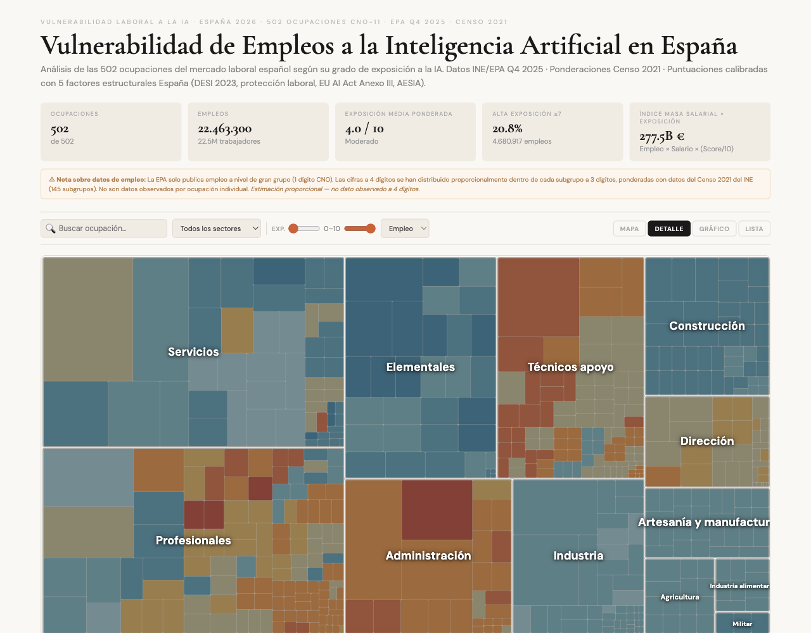
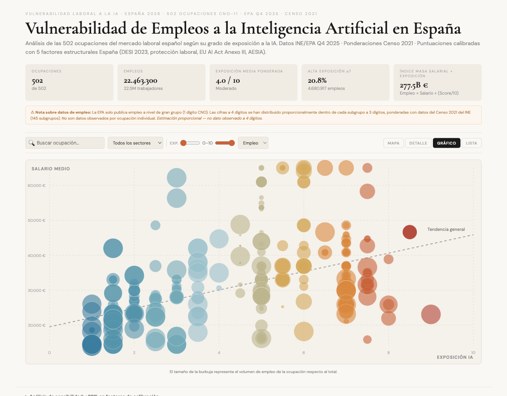

<div align="center">

# Vulnerabilidad de Empleos a la IA en Espana

### Mapa interactivo de exposicion a la inteligencia artificial del mercado laboral espanol

**502 ocupaciones** · **22,4 millones de empleos** · **12 sectores economicos**

[**Ver Demo en Vivo**](https://empleo-ia.lovable.app) · [**Metodologia V20 (PDF)**](https://doi.org/10.5281/zenodo.19076797) · [**Abrir HTML standalone**](empleo-ia.html)

---

</div>



<div align="center">

<table>
<tr>
<td align="center"><strong>502</strong><br><sub>Ocupaciones CNO-11</sub></td>
<td align="center"><strong>22,4M</strong><br><sub>Empleos analizados</sub></td>
<td align="center"><strong>4.0 / 10</strong><br><sub>Exposicion media</sub></td>
<td align="center"><strong>20.8%</strong><br><sub>Alta exposicion (>=7)</sub></td>
<td align="center"><strong>277.5B EUR</strong><br><sub>Indice masa salarial</sub></td>
</tr>
</table>

</div>

## Que es esto?

Un dashboard interactivo que analiza **todas las ocupaciones del mercado laboral espanol** segun su grado de exposicion a la inteligencia artificial. Combina datos oficiales del INE (EPA Q4 2025, Censo 2021, EES 2023) con puntuaciones de exposicion IA calibradas con 5 factores estructurales de Espana.

> **No es una prediccion de desplazamiento laboral.** Las puntuaciones miden exposicion teorica, no adopcion real. La evidencia empirica (Anthropic, feb. 2026) muestra diferencias significativas: 94% exposicion teorica vs 33% adopcion observada en ocupaciones informaticas.

---

## Vistas interactivas

<table>
<tr>
<td width="50%">

### Treemap detallado
Cada rectangulo = una ocupacion. Area proporcional al empleo, color segun nivel de exposicion IA (azul = bajo, rojo = alto). Agrupado por sector.

</td>
<td width="50%">

### Scatter plot
Salario medio vs. exposicion IA. Tamano de burbuja proporcional al volumen de empleo. Linea de tendencia general.

</td>
</tr>
<tr>
<td>

### Treemap sectorial
Vista agregada: un bloque por sector con score medio ponderado, total de empleos y numero de ocupaciones. Click para explorar.

</td>
<td>

### Lista ordenable
Tabla completa con score, nombre, sector, empleados, salario y clasificacion EU AI Act. Ordenable por cualquier columna.

</td>
</tr>
</table>



**Cada ocupacion incluye:**
- Puntuacion de exposicion IA (0-10) con indicador de color
- Numero de empleados y salario medio
- Clasificacion EU AI Act (Alto riesgo / Limitado / Minimo)
- Tipo de impacto (Sustitucion / Hibrido / Aumentacion)
- Vector de automatizacion (texto explicativo del mecanismo de exposicion)
- Indice de masa salarial x exposicion
- Botones de compartir (X, LinkedIn, WhatsApp, email, copiar)

---

## Quick Start

### Opcion A: Sin instalacion (HTML autonomo)

```bash
# Descarga y abre — no necesitas nada mas
open empleo-ia.html
```

El archivo `empleo-ia.html` (~421KB) contiene **todo**: React, logica, estilos y los 502 registros de datos embebidos. Solo necesita conexion a internet para cargar React desde CDN y las fuentes de Google.

### Opcion B: Desarrollo con Vite

```bash
npm install        # Instalar dependencias
npm run dev        # Servidor de desarrollo (http://localhost:5173)
npm run build      # Build de produccion
npm run preview    # Preview del build
```

---

## Dataset

### `public/data/spain_502_FINAL_v7.json`

| Campo | Tipo | Descripcion |
|:------|:-----|:------------|
| `cno` | `int` | Codigo CNO-11 a 4 digitos |
| `nombre` | `str` | Nombre oficial de la ocupacion |
| `sector` | `str` | Sector economico (12 categorias) |
| `empleo` | `int` | N. empleados — estimacion EPA Q4 2025 + Censo 2021 |
| `salario_medio_eur` | `float` | Salario medio anual (EES 2023 + ajustes) |
| `vulnerabilidad_ia_score` | `float` | Exposicion a la IA, escala 0-10 |
| `eu_ai_act` | `str` | `Alto riesgo` · `Limitado` · `Minimo` |
| `tipo_impacto` | `str` | `Sustitucion` · `Hibrido` · `Aumentacion` |
| `justificacion` | `str` | Vector de automatizacion (texto largo) |

<details>
<summary><strong>Campos auxiliares (solo en el JSON completo)</strong></summary>

| Campo | Descripcion |
|:------|:------------|
| `empleo_pre_bayes` | Empleo antes del ajuste bayesiano |
| `empleo_delta_bayes` | Delta del shrinkage bayesiano |
| `bayes_B_3digit` | Factor de shrinkage a 3 digitos |
| `census_2021_employed` | Empleados segun Censo 2021 |
| `employment_method` | Metodo de estimacion utilizado |

</details>

---

## Metodologia

<table>
<tr>
<td width="60">

**1**

</td>
<td>

**Empleo** — EPA Q4 2025 microdatos (22,46M ocupados). Cifras a 4 digitos distribuidas con ponderaciones Censo 2021 a 3 digitos CNO (145 subgrupos). Empirical Bayes shrinkage. *Estimacion proporcional, no dato observado a 4 digitos.*

</td>
</tr>
<tr>
<td>

**2**

</td>
<td>

**Salarios** — Encuesta de Estructura Salarial 2023 (INE), ajustados con primas educativas INE y proxies internacionales (INSEE Francia, INE-PT Portugal). 121 valores unicos.

</td>
</tr>
<tr>
<td>

**3**

</td>
<td>

**Puntuaciones IA** — Generadas con Gemini 2.5 Pro (T=0.2, prompts estructurados). Calibradas con 5 factores estructurales Espana: indice DESI 2023, peso sector servicios, proteccion laboral, EU AI Act Anexo III, supervision AESIA.

</td>
</tr>
<tr>
<td>

**4**

</td>
<td>

**Validacion** — Re-puntuacion ciega de 100 ocupaciones estratificadas por GPT-4o. Resultados: **r = 0.715** · **ICC(2,1) = 0.701** · **kappa_w = 0.667** (acuerdo sustancial). MAD = 1.0 punto. 84% coinciden dentro de +/-2.0 puntos.

</td>
</tr>
</table>

> Documento completo con 44 notas tecnicas: [**Metodologia V20 en Zenodo**](https://doi.org/10.5281/zenodo.19076797)

---

## Regenerar el HTML autonomo

El archivo `empleo-ia.html` es una version self-contained generada a partir de los fuentes React. Para regenerarlo tras modificar codigo:

<details>
<summary><strong>Instrucciones paso a paso</strong></summary>

### 1. Reducir el JSON a los campos necesarios

```bash
python3 -c "
import json
with open('public/data/spain_502_FINAL_v7.json') as f:
    data = json.load(f)
minimal = [{
    'cno': str(d['cno']),
    'nombre': d['nombre'],
    'sector': d['sector'],
    'empleo': d['empleo'],
    'salario_medio_eur': d['salario_medio_eur'],
    'vulnerabilidad_ia_score': d['vulnerabilidad_ia_score'],
    'eu_ai_act': d['eu_ai_act'],
    'tipo_impacto': d['tipo_impacto'],
    'justificacion': d['justificacion']
} for d in data]
print(json.dumps(minimal, ensure_ascii=False, separators=(',', ':')))
" > /tmp/empleo_data.json
```

### 2. Estructura del HTML

```
<!DOCTYPE html>
<html>
<head>
  Meta tags + titulo
  Google Fonts (CDN)
  CSS inline (keyframes de animacion)
  React 18 + ReactDOM 18 (CDN unpkg)
  Babel standalone (CDN unpkg)
</head>
<body>
  <div id="root"></div>
  <script id="occupation-data" type="application/json">
    [...datos JSON inline...]
  </script>
  <script type="text/babel">
    Constantes y helpers (SCORE_COLORS, EU_LABELS, etc.)
    squarify() — algoritmo de treemap
    ScoreBadge, OccupationTooltip — componentes
    Dashboard — componente principal con las 4 vistas
    App — carga datos del <script> embebido
    ReactDOM.createRoot(...).render(<App />)
  </script>
</body>
</html>
```

### 3. Cambios clave vs. la app React/Vite

- Eliminar anotaciones TypeScript (tipos, interfaces, genericos)
- Reemplazar `import` por funciones en el mismo scope
- Cambiar `<>...</>` por `<React.Fragment>...</React.Fragment>`
- Cargar datos de `document.getElementById("occupation-data").textContent` en vez de `fetch()`
- No se usa Tailwind — todo el estilado ya era inline

</details>

---

## Stack

| | Tecnologia | Proposito |
|:--|:-----------|:----------|
| **Framework** | React 18 | UI reactiva |
| **Build** | Vite 5 | Dev server + bundling |
| **Lenguaje** | TypeScript | Tipado estatico |
| **Visualizacion** | SVG nativo | Treemaps, scatter plots, histogramas |
| **Treemap** | Squarified (impl. propia) | Layout proporcional al empleo |
| **Fuentes** | DM Sans + Cormorant Garamond | UI + datos/titulos |
| **UI base** | shadcn/ui + Radix | Componentes accesibles |

---

## Estructura

```
empleo-ia/
|
|-- empleo-ia.html                         HTML autonomo (todo en uno, ~421KB)
|
|-- public/data/
|   |-- spain_502_FINAL_v7.json            Dataset principal (502 ocupaciones)
|   |-- ocupaciones_*_100.json             Subset validacion (100 ocupaciones)
|   '-- ia-empleo-espana-metodologia-v20.pdf
|
|-- src/
|   |-- pages/Index.tsx                    Dashboard principal (~860 lineas)
|   |-- components/empleo/
|   |   |-- Badge.tsx                      Indicador circular de score
|   |   |-- DetailPanel.tsx                Panel lateral de detalle
|   |   '-- OccupationTooltip.tsx          Tooltip hover rico
|   '-- lib/
|       |-- occupationData.ts              Tipos, constantes, helpers, parsers
|       '-- treemap.ts                     Algoritmo squarified treemap
|
|-- docs/
|   |-- screenshot-hero.png                Screenshot principal (README)
|   '-- screenshot-scatter.png             Screenshot scatter (README)
|
'-- package.json, vite.config.ts, ...      Config
```

---

<div align="center">

### Fuentes de datos

**INE** (EPA Q4 2025 · Censo 2021 · EES 2023) · **SEPE** (CNO-11) · **Comision Europea** (DESI 2023 · EU AI Act)

---

**Metodologia V20** · Validacion inter-modelo: kappa_w = 0.667

(c) 2026 A. de Nicolas, M. Sureda

</div>
